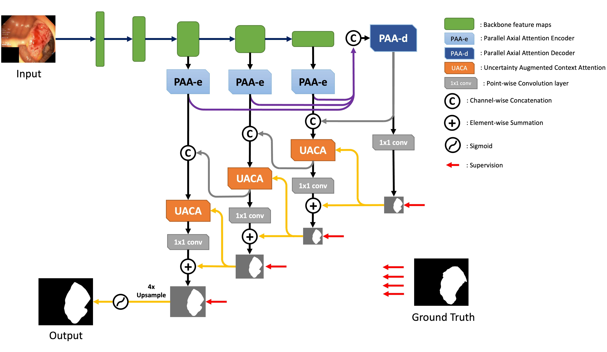

# UACANet
Official pytorch implementation of [UACANet: Uncertainty Aware Context Attention for Polyp Segmentation](https://NOTAVAIABLEYET)  
To appear in the Proceedings of the 29th ACM International Conference on Multimedia (ACM MM '21)



## Abstract

We propose Uncertainty Augmented Context Attention network (UACANet) for polyp segmentation which consider a uncertain area of the saliency map. We construct a modified version of U-Net shape network with additional encoder and decoder and compute a saliency map in each bottom-up stream prediction module and propagate to the next prediction module. In each prediction module, previously predicted saliency map is utilized to compute foreground, background and uncertain area map and we aggregate the feature map with three area maps for each representation. Then we compute the relation between each representation and each pixel in the feature map. We conduct experiments on five popular polyp segmentation benchmarks, Kvasir, CVC-ClinicDB, ETIS, CVC-ColonDB and CVC-300, and achieve state-of-the-art performance. Especially, we achieve 76.6% mean Dice on ETIS dataset which is 13.8% improvement compared to the previous state-of-the-art method.

## 1. Create environment
  + Create conda environment with following command `conda create -n uacanet python=3.7`
  + Activate environment with following command `conda activate uacanet`
  + Install requirements with following command `pip install -r requirements.txt`
  
## 2. Prepare datasets
  + Download dataset from following [URL](https://drive.google.com/file/d/17Cs2JhKOKwt4usiAYJVJMnXfyZWySn3s/view?usp=sharing)
  + Move folder `data` to the repository.
  + Folder should be ordered as follows,
```
|-- configs
|-- data
|   |-- TestDataset
|   |   |-- CVC-300
|   |   |   |-- images
|   |   |   `-- masks
|   |   |-- CVC-ClinicDB
|   |   |   |-- images
|   |   |   `-- masks
|   |   |-- CVC-ColonDB
|   |   |   |-- images
|   |   |   `-- masks
|   |   |-- ETIS-LaribPolypDB
|   |   |   |-- images
|   |   |   `-- masks
|   |   `-- Kvasir
|   |       |-- images
|   |       `-- masks
|   `-- TrainDataset
|       |-- images
|       `-- masks
|-- EvaluateResults
|-- lib
|   |-- backbones
|   |-- losses
|   `-- modules
|-- results
|-- run
|-- snapshots
|   |-- UACANet-L
|   `-- UACANet-S
`-- utils
```

## 3. Train & Evaluate
  + You can train with `python run/Train.py --config configs/UACANet-L.yaml`
  + You can generate prediction for test dataset with `python run/Test.py --config configs/UACANet-L.yaml`
  + You can evaluate generated prediction with `python run/Eval.py --config configs/UACANet-L.yaml`
  + You can also use `python Expr.py --config configs/UACANet-L.yaml` to train, generate prediction and evaluation in single command
  
  + (optional) Download our best result checkpoint from following [URL](https://drive.google.com/file/d/1C5ag5X_gKR1IHW6fVAHdMggu7ilU1XbC/view?usp=sharing) for UACANet-L and UACANet-S.

